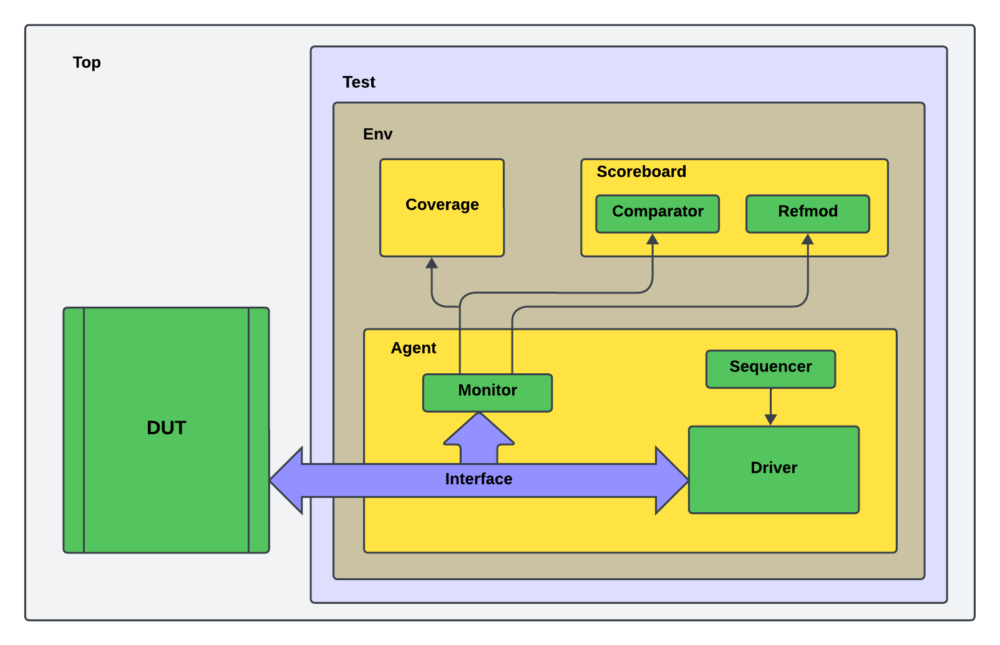

# Basic verification environment using UVM.

## Index
- [Verification Plan](#Plano-de-Verificação)
- [Structure of the UVM environment](#Estrutura-do-ambiente-UVM)
- [Resources](#Resources)
- [Simulation](#Simulation)
- [Author](#Author)
- [License](#License)

## Verification Plan

```
The Verification Plan is found in the README file within the "work" folder.
```

## Structure of the UVM environment



### Resources:

```
UVM 1.2

License Cadence/Xcelium.
```

## Simulation

To start the Simulation use the command:

```
./run.sh
```

## Author

* **André Medeiros** - [André Medeiros](https://github.com/andreemedeiros)

Contribution to the project [Adder-UVM](https://github.com/andreemedeiros/Adder-UVM/graphs/contributors).

## License

This project is licensed under the MIT License - see [LICENSE.md](LICENSE.md) for more details.
